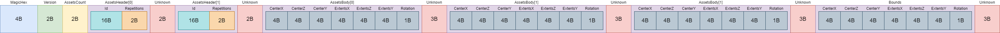
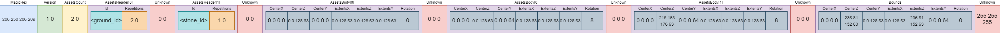

# Version 1

The Version 1 of TaleSpire slabs follow the byte array scheme below.



## Gzip
The content of the base64 string is a gzip file

## Example

One Rock And Two Grass

**Photo**


**Base64**
```
H4sIAAAAAAAE/2yLoQqCMRSFz5YsAwXfwmgQLXdVBGWYfQqbab7FmsFoMcuqdbBkFwSRPYGIkzv/8Zf/Xg7ng8MX3iEKSKg4mI6G49XhtZn1r5O9BPDw9+/6c1r6i9ptn4u5APB/S20zc+oV1ijNbKnXTLfjmb3OLRlH1UnGEQCNnPMvAAD//0KZ+COgAAAA
```
**Byte Array**
```
206 250 206 209 1 0 2 0 13 209 17 57 43 20 51 79 159 234 93 58 16 197 55 129 2 0 0 0 229 188 226 254 83 252 171 78 188 186 13 122 115 232 75 73 1 0 0 0 0 0 0 0 0 0 128 63 0 0 0 0 0 0 128 63 0 0 128 63 0 0 128 63 0 0 0 0 0 0 0 0 0 0 128 63 0 0 0 64 0 0 128 63 0 0 128 63 0 0 128 63 8 0 0 0 0 0 0 0 215 163 176 63 0 0 0 64 0 0 128 63 0 0 128 63 0 0 128 63 8 0 0 0 0 0 0 0 236 81 152 63 0 0 128 63 0 0 128 63 236 81 152 63 0 0 0 64 0 255 255 255
```


**Json**
```json
{
  "magic_hex": "zvrO0Q==",
  "version": 1,
  "assets_count": 2,
  "assets": [{
    "id": "DdEROSsUM0+f6l06EMU3gQ==",
    "layouts_count": 2,
    "layouts": [{
      "center": {
        "x": 0,
        "y": 1,
        "z": 0
      },
      "extents": {
        "x": 1,
        "y": 1,
        "z": 1
      },
      "rotation": 0
    }, {
      "center": {
        "x": 0,
        "y": 1,
        "z": 2
      },
      "extents": {
        "x": 1,
        "y": 1,
        "z": 1
      },
      "rotation": 8
    }]
  }, {
    "id": "5bzi/lP8q068ug16c+hLSQ==",
    "layouts_count": 1,
    "layouts": [{
      "center": {
        "x": 0,
        "y": 1.38,
        "z": 2
      },
      "extents": {
        "x": 1,
        "y": 1,
        "z": 1
      },
      "rotation": 8
    }]
  }],
  "bounds": {
    "center": {
      "x": 0,
      "y": 1.19,
      "z": 1
    },
    "extents": {
      "x": 1,
      "y": 1.19,
      "z": 2
    },
    "rotation": 0
  }
}
```