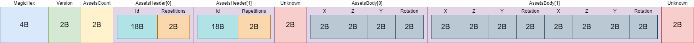
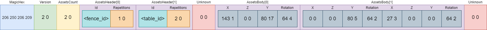

# Version 2

The Version 2 of TaleSpire slabs follow the byte array scheme below.



## Gzip
The content of the base64 string is a gzip file

## Example

One Fence and Two Tables

**Photo**


**Base64**
```
H4sIAAAAAAAACzv369xFJgYmBgaG7pL+4F2SeZ7t9wUSuyZLlDACxXYovn/klGjqOCNyUuOKTWF/QOr6gRIBgg4sQCZDAKsDkzQziOUAlAIAoQYiAEwAAAA=
```
**Byte Array**
```
206 250 206 209 2 0 2 0 0 0 139 116 143 83 186 25 110 73 135 223 16 97 138 147 24 116 1 0 0 0 184 33 239 226 66 97 53 65 152 89 146 129 168 178 86 252 2 0 0 0 143 1 0 0 80 17 64 4 0 0 0 0 80 5 64 2 27 3 0 0 0 0 64 2 0 0
```


**Json**
```json
{
  "magic_bytes": "zvrO0Q==",
  "version": 2,
  "assets_count": 2,
  "assets": [{
    "id": "AACLdI9TuhluSYffEGGKkxh0",
    "layouts_count": 1,
    "layouts": [{
      "coordinates": {
        "x": 399,
        "y": 4432,
        "z": 0
      },
      "rotation": 1088
    }]
  }, {
    "id": "AAC4Ie/iQmE1QZhZkoGoslb8",
    "layouts_count": 2,
    "layouts": [{
      "coordinates": {
        "x": 0,
        "y": 1360,
        "z": 0
      },
      "rotation": 576
    }, {
      "coordinates": {
        "x": 795,
        "y": 0,
        "z": 0
      },
      "rotation": 576
    }]
  }]
}
```

## Rotation Values
| Int16 | ByteArray | Degrees |
| :---: | :---: |:---:| 
| 0 | {0,0} | 0 |
| 64 | {64,0} | 15 |
| 128 | {128,0} | 30 |
| 192 | {192,0} | 45 |
| 256 | {0,1} | 60 |
| 320 | {64,1} | 75 |
| 384 | {128,1} | 90 |
| 448 | {192,1} | 105 |
| 515 | {0,2} | 120 |
| 576 | {64,2} | 135 |
| 640 | {128,2} | 150 |
| 704 | {192,2} | 165 |
| 768 | {0,3} | 180 |
| 832 | {64,3} | 195 |
| 896 | {128,3} | 210 |
| 960 | {192,3} | 225 |
| 1024 | {0,4} | 240 |
| 1088 | {64,4} | 255 |
| 1152 | {128,4} | 270 |
| 1216 | {192,4} | 285 |
| 1280 | {0,5} | 300 |
| 1344 | {64,5} | 315 |
| 1408 | {128,5} | 330 |
| 1472 | {192,5} | 345 |
| 1536 | {0,6}->{0,0} | 360->0 |

### Conversion
```
Degrees = float32(ByteArray As Int16) / 1536.0 * 360.0
```

### Generating slabs larger than 41 tiles on the Y axis

When generating slabs larger than 41 tiles on the Y axis, the rotation of the tile is taken into account. 

The algorithm used is the following:

``` 
Rotation = (Ny - 1) / 41  
```
Where Ny is the Y axis value of the Nth tile relative to the origin.

Ex:

``` 
For a line of 1x50 blocks of 1x1 grass:
- Blocks 0 ~ 40 will have a rotation equal to => [0,384,768,1152] + 0
- Blocks 41 ~ 49 will have a rotation equal to => [0,384,768,1152] + 1
Note: The values inside the brackets are the possible base rotations for the 1x1 grass tile.
Other values may apply to other blocks.
```
 
